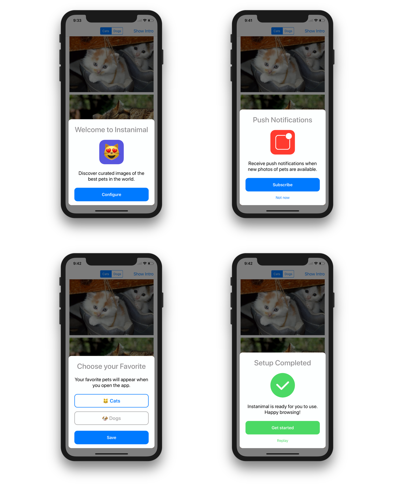
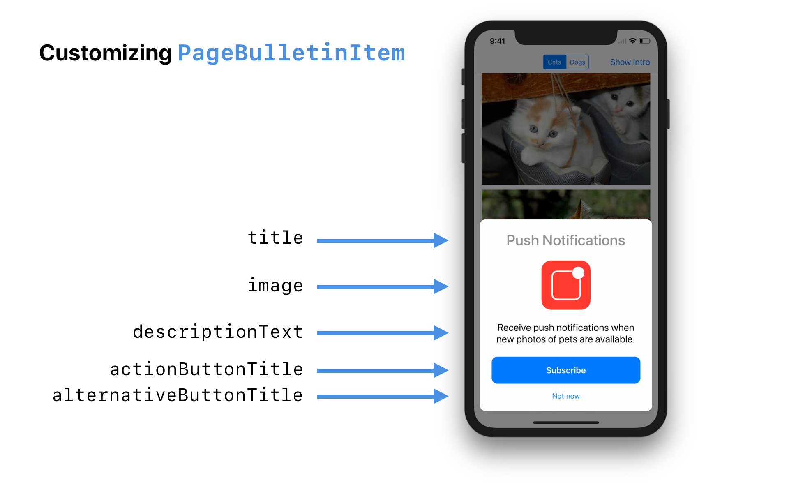

# BulletinBoard

BulletinBoard is an iOS library that generates and manages contextual cards displayed at the bottom of the screen. It is especially well suited for quick user interactions such as onboarding screens or configuration.

It has an interface similar to the cards displayed by iOS for AirPods, Apple TV configuration and NFC tag scanning,

Here are some screenshots showing what you can build with BulletinBoard:

## Requirements

- iOS 9 and later
- Swift 4

## Demo

A demo application is included in the `BulletinBoard` workspace. It demonstrates how to: 

- integrate the library (setup, data flow)
- create standard page panes
- create custom page subclasses to add features
- create custom cards from scratch

Build and run the `Instanimal` scheme to use it.

Here's a video showing it in action:

## Installation

BulletinBoard is available via CocoaPods and Carthage.

### CocoaPods

To install BulletinBoard using [Carthage](https://github.com/Carthage/Carthage), add this line to your `Cartfile`:

~~~ruby
pod "BulletinBoard"
~~~

### Carthage

To install BulletinBoard using [Carthage](https://github.com/Carthage/Carthage), add this line to your `Cartfile`:

~~~
github "alexaubry/BulletinBoard"
~~~

## Usage

In this section, you will learn:

- the basics
- how to create custom items

If you need help integrating the library, feel free to open an issue.

### The Basics

The `BulletinManager` class generates, manages and displays bulletin items.

Bulletin items are objects that conform to the `BulletinItem` protocol.

The library provides a standard page item type: `PageBulletinItem`. 

### Creating Page Items

You create page items using the `PageBulletinItem` class.

It takes care of generating a user interface with standard components:

- `title`
- `image`
- `descriptionText`
- `actionButtonTitle`
- `alternativeButtonTitle`

For example, this interface was created using `PageBulletinItem`:

To recreate this interface, use this code:

~~~swift
let page = PageBulletinItem(title: "Push Notifications")
page.image = UIImage(named: "...")

page.descriptionText = "Receive push notifications when new photos of pets are available."
page.actionButtonTitle = "Subscribe"
page.alternativeButtonTitle = "Not now"
~~~

If you omit an optional property, a view will not be generated for it. For instance, if you set `image` to `nil`, the card won't display an image view.

### Creating Custom Items

## Author

Written by Alexis Aubry. You can [find me on Twitter](https://twitter.com/_alexaubry).

## License

BulletinBoard is available under the MIT license. See the [LICENSE](LICENSE) file for more info.
