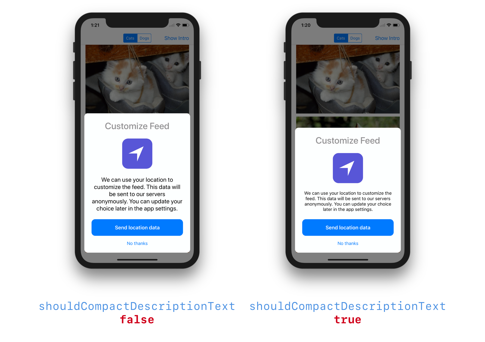
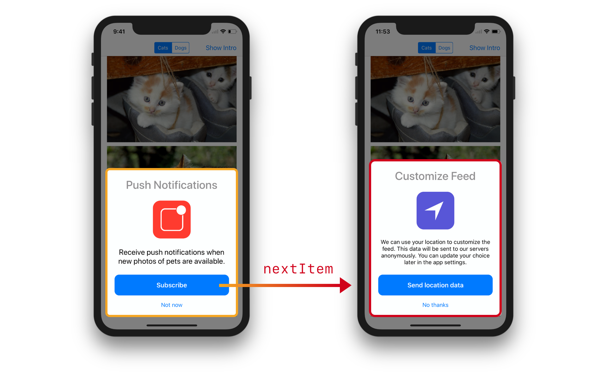

# BulletinBoard

BulletinBoard is an iOS library that generates and manages contextual cards displayed at the bottom of the screen. It is especially well suited for quick user interactions such as onboarding screens or configuration.

It has an interface similar to the cards displayed by iOS for AirPods, Apple TV configuration and NFC tag scanning,

Here are some screenshots showing what you can build with BulletinBoard:

## Requirements

- iOS 9 and later
- Swift 4

## Demo

A demo application is included in the `BulletinBoard` workspace. It demonstrates how to: 

- integrate the library (setup, data flow)
- create standard page cards
- create custom page subclasses to add features
- create custom cards from scratch

Build and run the `Instanimal` scheme to use it.

Here's a video showing it in action:

## Installation

BulletinBoard is available via CocoaPods and Carthage.

### CocoaPods

To install BulletinBoard using [CocoaPods](https://cocoapods.org), add this line to your `Podfile`:

~~~ruby
pod "BulletinBoard"
~~~

### Carthage

To install BulletinBoard using [Carthage](https://github.com/Carthage/Carthage), add this line to your `Cartfile`:

~~~
github "alexaubry/BulletinBoard"
~~~

## Usage

## The Basics

The `BulletinManager` class generates, manages and displays bulletin cards. Cards are created using bulletin items. Bulletin items are objects that conform to the `BulletinItem` protocol.

The library provides a standard item type: `PageBulletinItem`. If you need to customize the items, you can override this class, or create new item types from scratch.

To present bulletins, you need to follow these steps:

1. Create a root item
2. Create a bulletin manager with the root item
3. Use the bulletin manager to present the bulletin over your view controller

## Creating Page Items

You can create standard page items using the `PageBulletinItem` class.

It takes care of generating a user interface with standard components:

- a title (required)
- an icon image (should be 100x100px or less)
- a description text
- a large action button
- a smaller alternative button

For example, this interface was created using a `PageBulletinItem`:

To recreate this interface, use this code:

~~~swift
let page = PageBulletinItem(title: "Push Notifications")
page.image = UIImage(named: "...")

page.descriptionText = "Receive push notifications when new photos of pets are available."
page.actionButtonTitle = "Subscribe"
page.alternativeButtonTitle = "Not now"
~~~

If you omit an optional property, the page won't generate a view for it. For instance, if you set `alternativeButtonTitle` to `nil`, the card won't display an alternative button.

### Customizing The Appearance

#### Colors

You can customize the colors of the page by using the `interfaceFactory` property.

This property references a `BulletinInterfaceFactory`, which is responsible for generating the standard components (more on this later).

There are two properties that you can change:

- `tintColor` - the tint color of the buttons (defaults to iOS blue)
- `actionButtonTitleColor` - the color of action button titles

You need to set these before you present / push the item. Changing them after presentation will have no effect.

#### Text Size

If the description text is long, you can set the `isLongDescriptionText` property to `true` to reduce the text size.

### Handling Button Taps

To handle taps on buttons, set a closure for these properties:

- `actionHandler` - called when the action button is tapped.
- `alternativeHandler` - called when the alternative button is tapped.

~~~swift
page.actionHandler = { (item: PageBulletinItem) in
    print("Action button tapped")
}
~~~

This prints `"Action button tapped"` when the action button is tapped.

~~~swift
page.alternativeHandler = { (item: PageBulletinItem) in
    print("Alternative button tapped")
}
~~~

This prints `"Alternative button tapped"` when the alternative button is tapped.

Use these handlers as an opportunity to change the presented item, dismiss the bulletin and/or pass data to your model.

## Changing the Presented Item

The `BulletinItem` protocol exposes a `manager` property that is set when the item is currently being displayed by a manager.

You can use it to interact with the presented bulletin. Call:

- `manager?.popItem()` to go back to the previous item
- `manager?.popToRootItem()` to go back to the first item
- `manager?.push(item:)` with a `BulletinItem` to present a new item.

You need to call these methods from the main thread. Never force unwrap `manager`, as this property will be unset as soon as the item will be hidden from the bulletin.

It is also possible to set the `nextItem` property to the `BulletinItem` that should be displayed next and all the `displayNextItem()` method when you want to display it. This provides a more flexible and reusable way to build your item hierarchy.

For instance, to change

~~~swift
page.nextItem = makeLocationPage() // Creates a new PageBulletinItem

page.actionHandler = { (item: PageBulletinItem) in
    item.displayNextItem()
}
~~~

This creates the following interaction:

## Creating Custom Items

## Internals

## Author

Written by Alexis Aubry. You can [find me on Twitter](https://twitter.com/_alexaubry).

## License

BulletinBoard is available under the MIT license. See the [LICENSE](LICENSE) file for more info.
